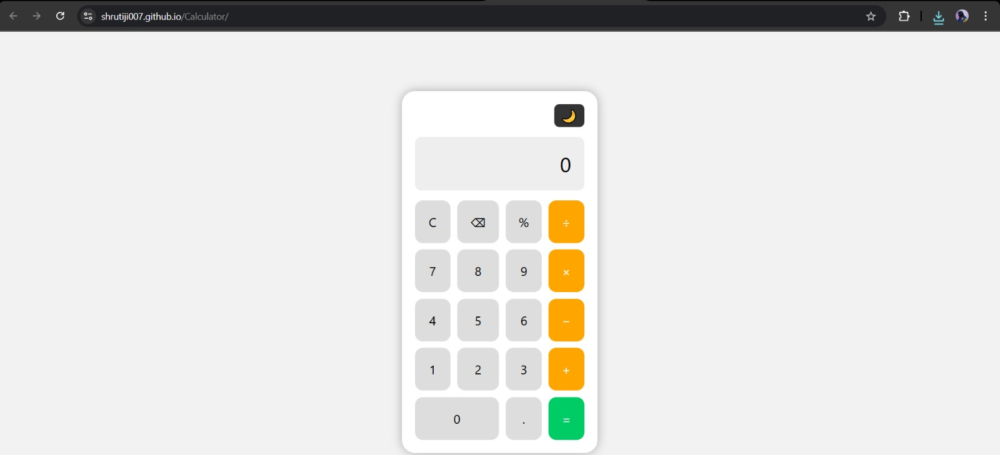
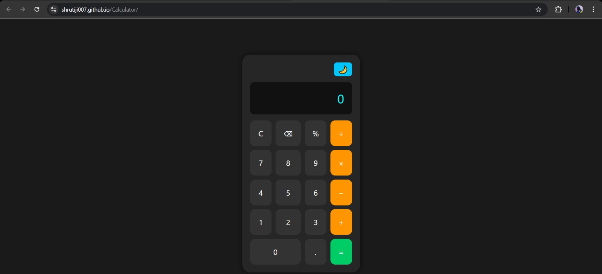
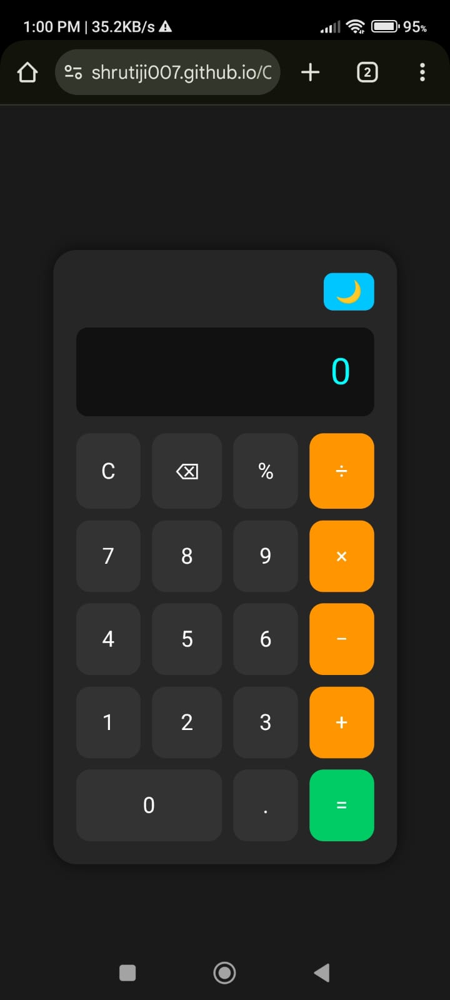

# 🔢 Online Calculator

A simple, responsive calculator built using HTML, CSS, and JavaScript.

This calculator supports basic math operations — addition, subtraction, multiplication, division, percentage — and includes keyboard support and a light/dark theme toggle.

---

## 🌐 Live Demo

👉 [Use the calculator here](https://shrutiji007.github.io/Calculator/)

---

## ✨ Features

- ➕ Basic math operations (+, −, ×, ÷, %)
- 💡 Light/Dark theme toggle
- ⌨️ Keyboard support
- ❌ Input validation to avoid invalid expressions
- 📱 Mobile responsive design

---

## 📁 Tech Stack

- HTML
- CSS (custom styling, no frameworks)
- JavaScript (vanilla)

---

## 📸 Preview

### 💻 Desktop View

#### 🌞 Light Mode

#### 🌚 Dark Mode

---

### 📱 Mobile View

#### 🌞 Light Mode

#### 🌚 Dark Mode

---

## 🙋‍♀️ Author

Made with ❤️ by [Shruti](https://github.com/Shrutiji007)

---
